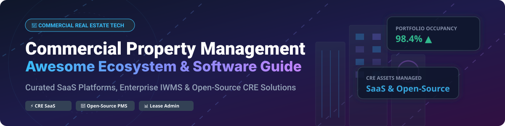

# 🏢 Awesome Commercial Property Management Software & Systems Ecosystem 🚀

  

  
  
  
  

> 🌟 **A comprehensive, curated directory of Commercial Property Management (CPM) SaaS platforms, enterprise IWMS solutions, and open-source real estate software.**
>
> *Covering Commercial Real Estate (CRE) portfolio management, ASC 842 / IFRS 16 lease administration, tenant portal operations, CAM reconciliation accounting, facility management, and open-source proptech stacks.*

---

## 📑 Table of Contents
- [📊 Market Overview & Industry Structure](#-market-overview--industry-structure)
- [💼 SaaS & Commercial Hosted Platforms](#-saas--commercial-hosted-platforms)
- [🔓 Open-Source GitHub Projects](#-open-source-github-projects)
- [🛠️ Architecture Playbook for Open CRE Stacks](#️-architecture-playbook-for-open-cre-stacks)
- [🤝 How to Contribute](#-how-to-contribute)
- [💖 Support & Sponsorship](#-support--sponsorship)
- [📈 Star History](#-star-history)
- [⚠️ Disclaimer](#️-disclaimer)

---

## 📊 Market Overview & Industry Structure 📈

The global **Commercial Property Management Software (CPMS)** and **Integrated Workplace Management System (IWMS)** market size is estimated at **$21.4 Billion in 2026** and is projected to reach **$34.8 Billion by 2030** (CAGR ~10.2%).

> [!NOTE]
> **Market Fragmentation**: The sector is **moderately to highly fragmented** at the SMB and mid-market landlord tier (served by AppFolio, DoorLoop, Buildium, TenantCloud). However, it exhibits strong **oligopolistic concentration** at the enterprise tier (dominated by Yardi Voyager, RealPage, MRI Software, and IBM TRIRIGA). Enterprise CRE demands complex multi-entity GAAP accounting, CAM (Common Area Maintenance) recovery calculations, ASC 842 compliance, and institutional lender reporting, creating high switching costs and enterprise stickiness.

---

## 💼 SaaS & Commercial Hosted Platforms 🌐

Below is a comparative breakdown of top commercial property management software (CPMS) SaaS platforms, sorted by estimated company scale (Revenue / Valuation) in descending order.

| Platform | Description & Key Focus | Est. Scale (Valuation / Revenue) | Standard Starting Pricing | Free Tier / Trial Limit |
| :--- | :--- | :--- | :--- | :--- |
| **[IBM TRIRIGA](https://www.ibm.com/products/tririga)** 🏢 | Enterprise IWMS for CRE portfolio lease management, environmental impact tracking, space planning, and capital projects. | **~$170B+ (Parent IBM)** | $1,200/user/year (Enterprise quotes) | No free tier; 30-day guided interactive demo trial |
| **[Trimble Manhattan](https://www.trimble.com/)** 📍 | Global workplace and real estate management system for corporate CRE portfolios and lease compliance. | **~$15B+ (Parent Trimble)** | $10,000/year base platform fee | No free tier; custom Sandbox trial environment on request |
| **[RealPage](https://www.realpage.com/)** 🏙️ | Comprehensive CRE and commercial property accounting, revenue management, and tenant operations suite. | **~$10.2B (Acquired by Thoma Bravo)** | $250/month base platform fee | No free tier; 14-day sales-assisted trial environment |
| **[Yardi Voyager](https://www.yardi.com/)** 🏛️ | Premier enterprise real estate software for complex commercial, retail, industrial, and mixed-use portfolios. | **~$3.0B+ Annual Revenue** | $1.00/unit/month ($1,500/month min) | No free tier; live customized sandbox trial for enterprise evaluations |
| **[MRI Software](https://www.mrisoftware.com/)** 🏭 | Enterprise CRE management & multi-entity accounting suite with tenant web portals and vendor management. | **~$5.0B+ Valuation** | $300/month starting base plan | No free tier; 14-day enterprise product demonstration environment |
| **[AppFolio Property Manager](https://www.appfolio.com/)** 📊 | Modern cloud property management software with automated workflows, CAM tracking, and portal maintenance. | **~$4.5B+ Market Cap** | $1.40/unit/month ($280/month min) | No free tier; 14-day feature-complete trial sandbox |
| **[Entrata](https://www.entrata.com/)** 🚪 | Operating system for commercial & residential real estate featuring accounting, portals, and lead management. | **~$3.0B Valuation** | $1.00/unit/month ($250/month min) | No free tier; 14-day sales-guided demo access |
| **[Building Engines](https://www.buildingengines.com/)** 🔧 | Building operations platform focusing on tenant work orders, preventative maintenance, and HVAC/leasing operations. | **~$1.0B (Acquired by JLL)** | $200/building/month starting | No free tier; 14-day guided building operations trial |
| **[Spacewell](https://www.spacewell.com/)** 🌿 | Smart building and IWMS platform for commercial facility maintenance, occupancy sensors, and space planning. | **~$800M+ (Nemetschek Group)** | $150/month starting base fee | No free tier; 30-day interactive web sandbox demo |
| **[ResMan](https://www.myresman.com/)** 🏘️ | Open-architecture property management solution providing leasing, accounting, and maintenance workflows. | **~$500M+ Valuation** | $1.50/unit/month ($175/month min) | No free tier; 14-day full feature trial |
| **[Buildium](https://www.buildium.com/)** 📑 | Small to mid-size property management software covering rent collection, tenant screening, and accounting. | **~$500M (RealPage subsidiary)** | $55/month starting Essential plan | No free tier; 14-day full access free trial (no credit card required) |
| **[Propertyware](https://www.propertyware.com/)** 🗝️ | Flexible property management system for portfolio administration, maintenance scheduling, and custom reports. | **~$400M+ Valuation** | $1.00/unit/month ($250/month min) | No free tier; 15-day free software trial |
| **[FM:Systems](https://fmsystems.com/)** 📐 | Workplace management & IWMS software for desk booking, space utilization, and commercial facility planning. | **~$350M+ (Acquired by Johnson Controls)** | $300/month starting facility tier | No free tier; 14-day interactive workplace trial |
| **[Visual Lease](https://www.visuallease.com/)** 📜 | Specialized lease accounting and lease administration software compliant with ASC 842, IFRS 16, and GASB 87. | **~$250M+ Valuation** | $350/month starting tier | No free tier; 14-day lease compliance trial |
| **[DoorLoop](https://www.doorloop.com/)** ⚡ | All-in-one software for commercial real estate, retail, office, and mixed-use property management. | **~$150M+ Valuation** | $59/month starting plan (up to 20 units) | No free tier; 30-day 50% discount trial with 30-day money-back guarantee |
| **[Rent Manager](https://www.rentmanager.com/)** 📱 | Highly customizable CRE property management software with open API, standalone accounting, and work order dispatch. | **~$100M+ Annual Revenue** | $1.00/unit/month ($200/month min) | No free tier; 14-day custom demo environment |
| **[Archibus](https://archibus.com/)** 🗺️ | Comprehensive IWMS & real estate portfolio management suite for workspace analytics and preventive upkeep. | **~$100M+ Valuation** | $500/month base platform license | No free tier; 30-day software evaluation license |
| **[TenantCloud](https://www.tenantcloud.com/)** ☁️ | Cloud-based property management platform tailored for independent landlords and small commercial property owners. | **~$50M+ Valuation** | $17/month starting Starter plan | Free Plan available (up to 75 units, limited features) |

---

## 🔓 Open-Source GitHub Projects 🌟

Below are notable open-source property management systems (PMS), computer-aided facility management (CAFM) tools, enterprise resource planning (ERP) modules, and real estate developer frameworks sorted by GitHub star count in descending order.

| Project Name | Stars & Stargazers Link | Description & Primary Use Case | License |
| :--- | :--- | :--- | :--- |
| **[Odoo Core & Real Estate](https://github.com/odoo/odoo)** 🏢 |  | Open-source enterprise ERP with extensive suite of real estate, maintenance, lease billing, and facility modules. | LGPL-3.0 |
| **[ERPNext](https://github.com/frappe/erpnext)** 📐 |  | Full-fledged open ERP featuring property management modules, unit leasing, maintenance work orders, and accounting. | GPL-3.0 |
| **[Apache OFBiz](https://github.com/apache/ofbiz)** ⚙️ |  | Suite of enterprise business applications for facility management, asset maintenance, and property accounting. | Apache-2.0 |
| **[Condo](https://github.com/open-condo-software/condo)** 🏢 |  | Modern open-source property management platform for ticket dispatch, tenant contacts, invoicing, and service marketplace. | MIT |
| **[Microrealestate](https://github.com/microrealestate/microrealestate)** 🏠 |  | Open-source web application for managing commercial and residential lease contracts, rent receipts, and payments. | MIT |
| **[cmdty / CMMS](https://github.com/cmms-dev/cmms)** 🛠️ |  | Computerized Maintenance Management System for commercial facility asset tracking and work order maintenance. | MIT |
| **[OpenProperty](https://github.com/clawnify/OpenProperty)** 🔑 |  | Self-hosted property management software as an open alternative to TenantCloud and AppFolio for lease and unit management. | AGPL-3.0 |
| **[OCA PMS (Odoo Property)](https://github.com/OCA/pms)** 📄 |  | Odoo Community Association (OCA) specialized repository for commercial property management, leases, and tenancy files. | AGPL-3.0 |
| **[OpenMAINT](https://github.com/openmaint/openmaint)** 🏛️ |  | Enterprise open-source solution for Property & Facility Management (space allocation, CMMS, asset lifecycle). | AGPL-3.0 |
| **[Homebox](https://github.com/syssi/homebox)** 📦 |  | Self-hosted inventory and asset management system adaptable for building equipment, maintenance tools, and unit fixtures. | MIT |
| **[Lease-Abstract-Helper](https://github.com/ishandutta2007/Awesome-Commercial-Property-Management)** 📑 |  | Python scripts and data schemas for automated commercial lease data extraction, financial modeling, and rent roll reporting. | MIT |

---

## 🛠️ Architecture Playbook for Open CRE Stacks 🏗️

When deploying custom, open-source commercial real estate solutions:

1. **Core ERP Engine**: Model properties, units, tenant entities, and leases using **ERPNext** or **Odoo PMS**.
2. **Operations & Work Orders**: Deploy **Condo** or **Microrealestate** for tenant ticketing and mobile maintenance dispatch.
3. **Facility & Space Management**: Integrate **OpenMAINT** or CMMS tools for preventative HVAC maintenance, floorplan mapping, and asset lifecycle tracking.
4. **Spatial & Portfolio Mapping**: Connect **PostgreSQL + PostGIS** to visualize commercial property boundaries, floor plans, and zoning data.
5. **Business Intelligence**: Pipe property accounting data into open dashboards (Metabase/Superset) for real-time occupancy and rent collection analytics.

---

## 🤝 How to Contribute 💡

Contributions are warmly welcomed! Help us keep this directory accurate and updated.

1. 🍴 **Fork** this repository.
2. 📝 **Add or edit** entries in `README.md` following the table format.
3. 🔍 Ensure description is factual, price/free trial is verified, and GitHub links point to valid repositories.
4. 🚀 **Submit a Pull Request** with a concise title (e.g., `Add ProjectName to Open-Source section`).

---

## 💖 Support & Sponsorship ☕

If this repository saved you research time or helped in your commercial property tech evaluations, please consider supporting the project!

- 🌟 **Star** this repository to increase visibility.
- 🔀 **Fork** and share with fellow proptech engineers and real estate operators.
- ☕ **Buy me a coffee / Sponsor**: Support ongoing maintenance via [GitHub Sponsors](https://github.com/sponsors/ishandutta2007).

Thank you for supporting open-source proptech and CRE data transparency! ❤️

---

## 📈 Star History 📊

---

## ⚠️ Disclaimer 📜

- This repository is a **community-curated list** for informational and educational purposes only.
- Pricing, valuations, and free tier terms are subject to change by respective software vendors.
- Commercial Property Management involves critical financial ledgers and tenant legal compliance. Ensure proper security, data backups, and regulatory verification before self-hosting open-source property management software.

---

  <b>Curated with ❤️ for property managers, CRE operators, facility managers, and proptech developers.</b>

